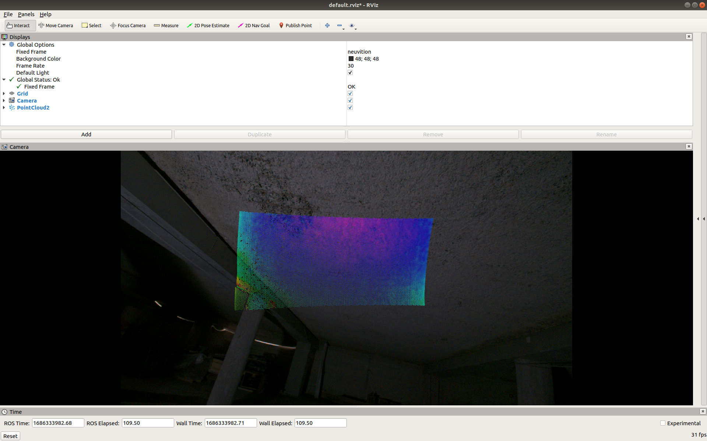

# Development-and-design-of-a-robotic-data-collection-platform

In this repository is located the packages used in the Bachelor thesis done by [Carlos Gascon Bononad](https://github.com/CarlosGB01) and [Javier Casas Lorenzo](https://github.com/hous3s). The aim of the thesis has been crating a Perception system for a robot, that combines LiDAR point-clouds and mono camera images. The camera is a Basler a2A1920 while the LiDAR is a solid-state Neuvition Titan M1-A. The camera has its intrinsic calibration done by the [ROS package](http://wiki.ros.org/camera_calibration), and the extrinsic calibration has been calculated using the [package developed here](https://github.com/beltransen/velo2cam_calibration). Finally, a package to save the data at the same rate has been developed.

## Launching the sensors

The command to launch the sensors are:
For the camera:
```
roslaunch pylon_camera pylon_camera_node.launch 
```
And for the LiDAR:
```
roslaunch neuvition_driver neuvition_driver.launch
```

The camera will publish a topic rectified image called `/pylon_camera_node/image_rect` in the frame `/pylon_camera` while the LiDAR publishes the topic with the point-cloud called `/neuvition_cloud` in the frame `neuvition`.

## Launching the transformation

The extrinsic calibration package creates its own `.launch` with the static transform for being used in ROS.

```
roslaunch velo2cam_calibration calibrated_tf.launch
```

To visualize everything together, launch `rviz` as seen here:



## Save synchronized data

Once the everything is set, to synchronize the data, the package `data_sync` has been created. This package will save the images as `jpg` and the point-clouds as `pcd` inside the folder of the package. The files will be called with the same name, the timestamp that they share. To launch the code:
```
roslaunch data_sync synchronizer.launch
```

